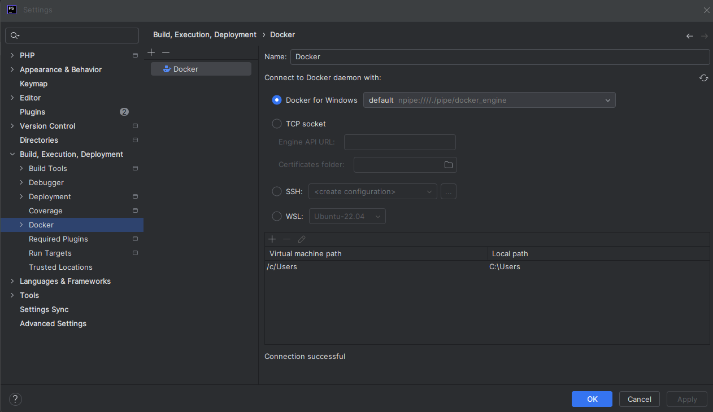
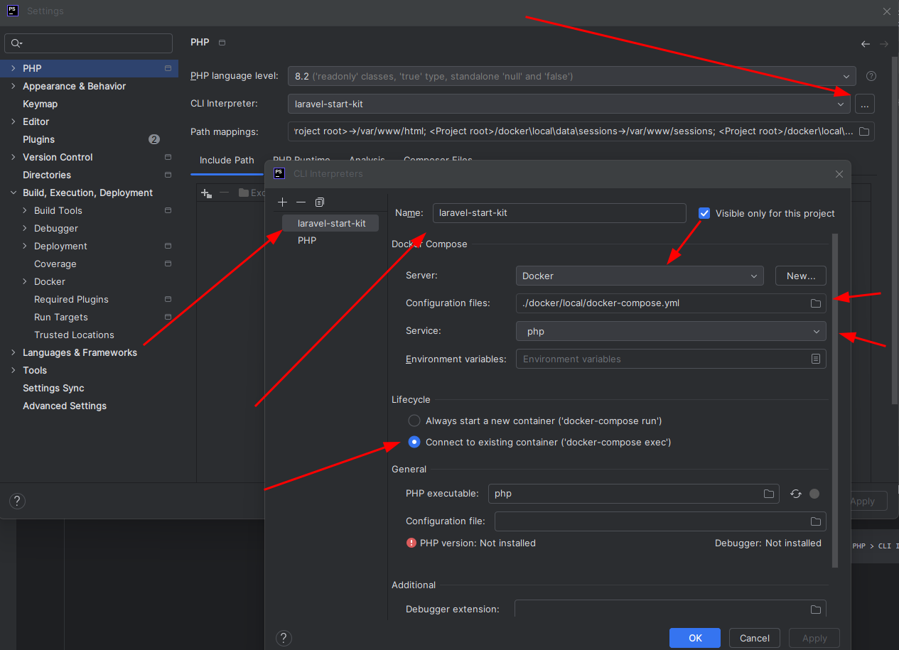
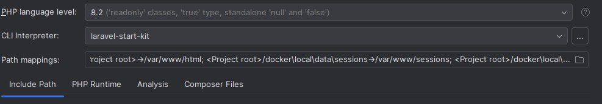
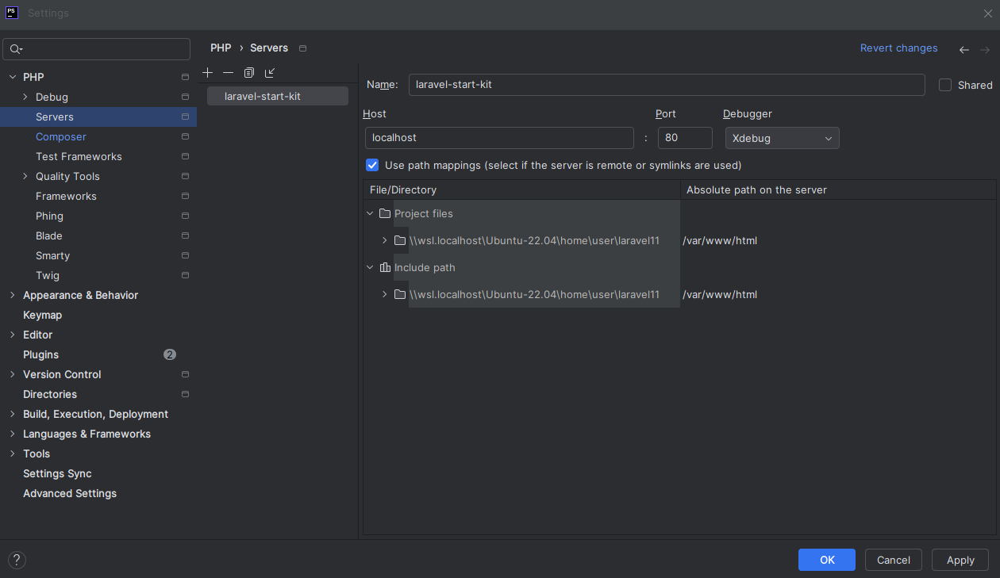
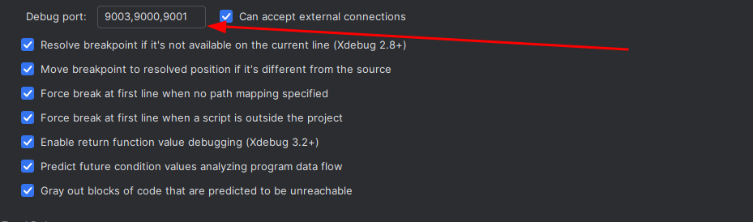
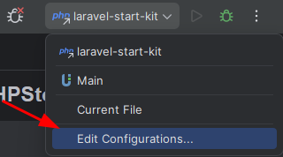
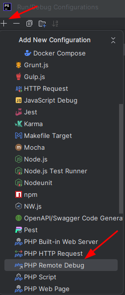
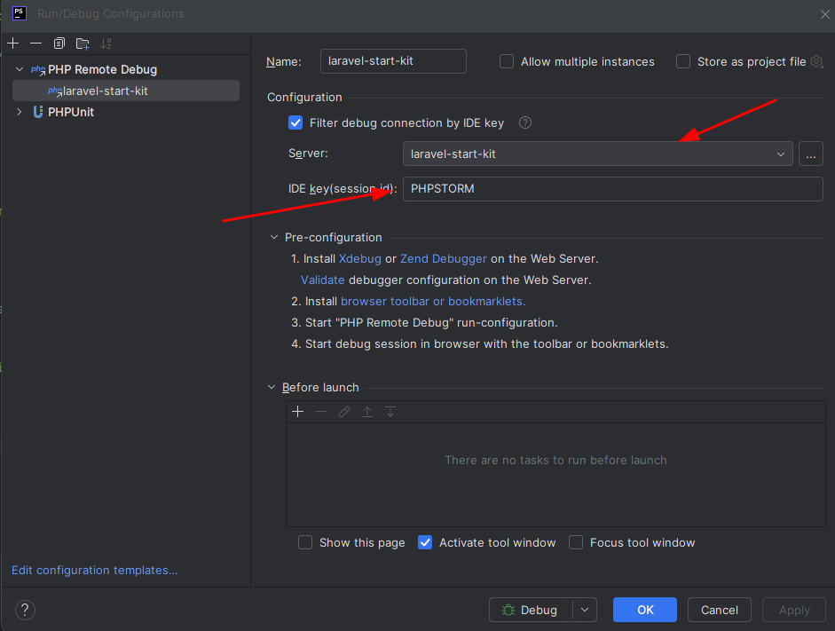

# Подключение Xdebug

## 1. Настраиваем интеграцию PHPStorm с Docker

    Идём в Settings > Build, Execution, Deployment > Docker 
    и создаём максимально простую интеграцию через локальное приложение Docker:
!

## 2. Настраиваем выполнение скриптов через удалённый (в контейнере) интерпретатор
    Идём в Settings > PHP > CLI Interpreter > 3 точки справа от него и добавляем такую конфигурацию:
    -----------------------------------------------------------------------------------------------
    Name может быть любым
    Server выбираем тот, который создали шагом ранее
    Configuration files: путь до docker-compose.yml
    Service: контейнер с PHP
    Остальное на ваш вкус, но в графе Lifecycle лучше оставить connect to existing container

```
Теперь, в графе CLI Interpreter вы увидите выбранным только что созданный конфиг:]()
```


## 3. Даём PHPStorm знать о том, как мы обращаемся к серверу
    Идём в Settings > PHP > Servers и добавляем новую конфигурацию сервера:
    Прокидываем маппинг для нашего проекта из докера /var/www/html
    Порт берём из своего конфига nginx. В моём случае он поднят в отдельном контейнере и смотрит наружу через 80
    Тут важно запомнить Name, это пригодится чуть позже

## 4. Чуть-чуть донастроим интеграцию PHPStorm с XDebug
    Идём в Settings > PHP > Debug > XDebug и добавляем порт 9001:


## 5. Меняем название сервера в .env
    в ./docker/local/.env поменять XDEBUG_SERVER_NAME="на свое назавние которое указывали в NAME"


# Возможные исправления что бы заработало
    если xdebug начинает постоянно с index.php, а не breakpoint'а:
        Это случилось, потому что ты нажал на "Break at first line in PHP scripts" в Event log.
        Чтобы отменить:
        Ctrl + Shift + A и напиши "break"
        В окошке поставь переключатель "Run Break at first line in PHP scripts" на OFF  

    Добавление xdebug в phpstorm



